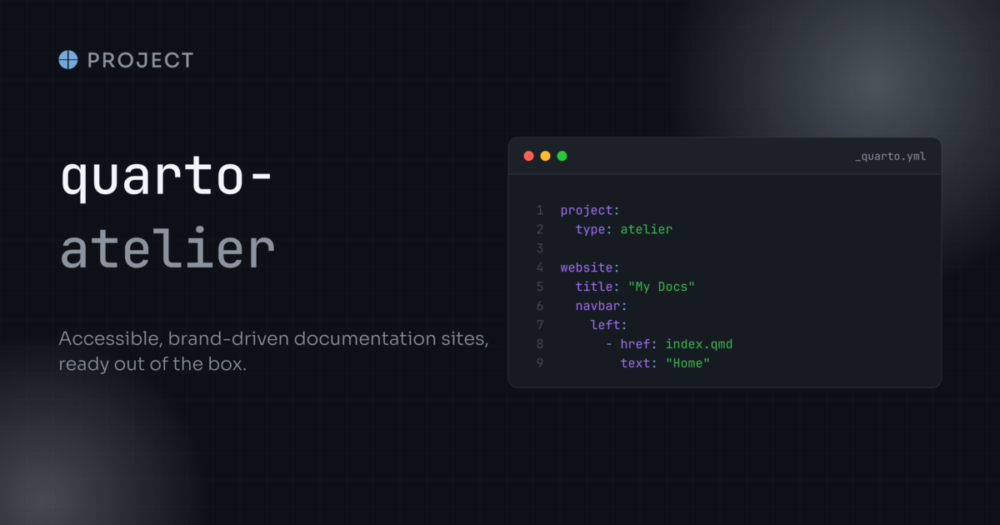

Set `project.type: atelier` in your `_quarto.yml`, provide a `_brand.yml`, then author pages as usual.
The sections below exercise the elements the project type styles for dark mode and accessibility; toggle the colour scheme while scrolling to see each one hold up.

## Announcement banner

The banner above the navbar is pinned to a light tint of its alert type with a contrast-picked ink, so it reads the same in both schemes.
Configure it as usual under `website.announcement`; without one, the rules are inert.

## Code

Inline `code`, a highlighted block:

```bash
quarto add mcanouil/quarto-atelier@0.10.1
```

and a plain block with no language:

```text
no language, still framed and styled
```

Hover a block: the copy button takes the palette accent instead of Quarto's fixed grey, in both schemes.

## Tabset

::: {.panel-tabset}

## First

Content of the first tab.

## Second

Content of the second tab.

:::

## Typography

Headings carry a slight positive tracking from `--atelier-heading-letter-spacing`.
Override it in a project stylesheet, for example with a small negative value for a tight serif.

Add that stylesheet under `format.atelier-html.theme`, not `format.html`, which would replace the project type's format and drop the theme along with the bundled scripts.

### A nested heading



## Framed embeds

`.embed-art` frames an embedded document or an image as a tilted card, centred on its own.

{.embed-art loading="lazy" title="The site's social card, framed" fig-alt="The quarto-atelier social card: the extension name over a one-line description, beside a dark code window showing a _quarto.yml that sets the atelier project type."}

The card here is the site's own social card, framed at its own dimensions: the frame carries no shape of its own, so the padding is the same on all four sides whatever it holds.
Give an `<embed>` a `width` and a `height` to size it, and override the `--atelier-embed-art-*` properties in a project stylesheet to change the fallback or the tilt.

## Table of contents

Scroll this page and watch the table of contents on the right: the active entry and its left border take the palette accent.

## Sidebar

The docked sidebar on the left is pinned to the same dark surface as the navbar and the footer in both colour schemes, with the current page on an accent pill, muted collapse chevrons, and dividers between the sections.
Narrow the window below 992px and it becomes the bar under the navbar that carries the toggle and the breadcrumbs.



## Footer and back to top

The page footer below shares the navbar surface and border, and its links take the navbar accent on hover.
Once you scroll, the back-to-top pill appears with a hairline derived from the page scheme.

## Navbar tooltips

Hover the colour-scheme toggle in the navbar, or the site title, for a themed tooltip on the palette surface rather than the browser default.
The named links beside them show no tooltip on purpose: an item with visible text is given an `aria-label` instead, because repeating the label would announce it twice to a screen reader.

## Dates

This page is dated with an ordinal suffix rendered by the bundled script.
